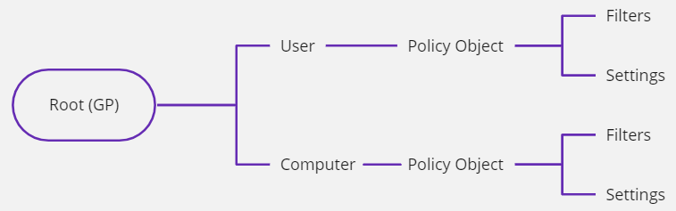
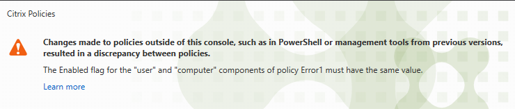

# Citrix Group Policy Provider

The Citrix Group Policy Provider (referred as the 'provider' in the rest of the document) is a Windows PowerShell snap-in that is implemented as a PowerShell provider. For more information on providers, see [Microsoft](https://docs.microsoft.com/en-us/powershell/module/microsoft.powershell.core/about/about_providers?view=powershell-7.1) documentation.

Citrix provider supports common provider commands such as the `Get-ChildItem` command and the `Set-ItemProperty` command.

## Prerequisites

-  Familiarity with Windows providers

## Install the Citrix Group Policy Provider

-  **For on-premises installations** - The provider is installed as part of the Citrix controller installation when installing Citrix Studio. You can install Citrix Studio on a supported Windows machine.
-  **For Citrix Cloud deployments** - The Citrix Remote PowerShell SDK is required. For more information about this SDK, see [SDKs and APIs](https://docs.citrix.com/en-us/citrix-virtual-apps-desktops-service/sdk-api.html) documentation.

## Manage policies using the provider

To manage policies using the provider, you must be a Citrix administrator with one of the following privileges:

-  Full administrators with default rights to manage policies.
-  Custom administrators with the permission to manage and view policies.

To begin managing policies using the provider, you must first load the provider to PowerShell session, which might be a Windows PowerShell console or a script to use the provider.  After loading the provider to PowerShell session, you must mount the provider to a drive.

### Step 1: Load the provider

To load the provider, navigate to the PowerShell console and run the following command:

    ```
    Import-Module Citrix.GroupPolicy.Commands
    ```

Alternatively, being a PowerShell snap-in, you can also load the provider using the following Add-PsSnapin command:

    ```
    Add-PsSnapin Citrix.Common.GroupPolicy
    ```

> **Note:**
>
>  If the provider does not load using the `Import-Module Citrix.GroupPolicy.Commands`  or the `Add-PsSnapin Citrix.Common.GroupPolicy`  command you might not have the provider installed in your system..

### Step 2: Mount the provider

PowerShell providers provide a user interface similar to a file system. At the top of the hierarchy is a drive, which is similar to a file system drive. After the provider is loaded, use commands to mount a provider to a drive so that its objects can be accessed. The four parameters of the command are the following:

-  The `-PsProvider` parameter specifies the name of the provider. The value must be specified and must be `CitrixGroupPolicy`.
-  The `-Name` parameter specifies the name of the drive.
-  The `-Root` parameter specifies the root of the drive in the hierarchy of the provider's object tree. Usually the root of the tree is specified.
-  The `-Controller` parameter specifies the Citrix controller to use.

Mount the provider to a drive using the following command:

-  On-premises: Use `localhost` to connect to a controller running on the same machine. When a remote host is specified, the remote host must be a Citrix controller and the necessary ports must be open for remotely connecting to the controller. The signed in user must be also an administrator of the remote site. If a remote connection is to be used, the fully qualified domain name (FQDN) of the remote controller with an optional port number must be specified. If no port number is specified, by default port 80 is used. To mount a drive for on-premises deployments, run the following command:

    ```
    New-PsDrive -PsProvider CitrixGroupPolicy -Name GP -Root \ -Controller localhost
    ```

-  Cloud: If the controller is a cloud controller, the connection must be made using the Citrix Remote PowerShell SDK. Run the following command to connect to a cloud environment. Before running this command, ensure that you are authenticated using the `Get-XDAuthentication` command or you have set an authentication profile. For example, `Set-XdCredentials`.

    ```
    New-PsDrive -PsProvider CitrixGroupPolicy -Name GP -Root \ -Controller $GLOBAL:XDSDKProxy -BearerToken $GLOBAL:XDAuthToken
    ```

After the **New-PsDrive** command is successfully run, the complete policy information is created as a file system under the name provided.

    ```
    cd GP:
    ```

## Navigating the object tree

Objects in the provider form a tree. At the top, the root of the tree is the drive root. In the root, there are two nodes named as **Computer** and **User** nodes respectively. The computer policies are stored in the **Computer** node. The user policies are stored in the **User** node.



The definition and difference between computer policies and user policies are listed in the following table:

| Computer policy | User policy |
| --- | --- |
| Computer policies are policy objects that include only computer settings.| User policies are policy objects that include only user settings.|
| Computer settings are settings that are validated for all user connections in the VDAs. Computer settings are applied only at the time of VDA reboots, restart of the Citrix Broker Agent (Citrix Desktop Service), or at 90 minute intervals.| User settings are settings that are validated at every user sign-in or reconnect.|

Policy objects are available either in the  computer or user node. There is **Settings** and **Filters** available for each policy object.

Policy filters are objects that determine how a policy is applied. The policy engine running on a VDA does the filtering calculation using a set of data called filter evidence. Filter evidence includes data such as the user name and the client name.

The objects in the **Settings** node of a policy node are settings and are organized using categories. Each category node includes subcategories or individual setting objects, which are the leaves of the tree under the **Settings** node. Nodes for all the settings are always defined and they cannot be created or removed. You can only configure a **Settings** node by changing the node's properties.

The objects under the **Filters** node of a policy node are filters, that you can create, modify, and delete.

## Create, modify, or delete a policy

### Create a policy

To create a computer policy, under the **Computer** node use the **New-Item command**. For example, the following command creates a policy named `Policy123`:

```
PS GP:\Computer\> New-Item Policy123

Name           : Policy123
Description    :
Enabled        : False
Priority       : 7
MergedPriority : 0
PSPath         : Citrix.Common.GroupPolicy\CitrixGroupPolicy::GP:\Computer\Policy123
PSParentPath   : Citrix.Common.GroupPolicy\CitrixGroupPolicy::GP:\Computer
PSChildName    : Policy123
PSDrive        : GP
PSProvider     : Citrix.Common.GroupPolicy\CitrixGroupPolicy
PSIsContainer  : True
```

After the policy is created, the properties of the policy object are displayed.

### Modify a policy

You can only modify the `Description`, `Enabled`, and the `Priority` properties for a policy. Do not set the `MergedPriority` property because only the Citrix Studio uses this property.

To modify a property of a policy, use the `Set-ItemProperty` command. For example, the following command sets the description of the policy to `test policy`:

```
PS GP:\Computer\> Set-ItemProperty -Path Policy123 -Name Description -Value "test policy"
PS GP:\Computer\> Get-ItemProperty Policy123

Name           : Policy123
Description    : test policy
Enabled        : False
Priority       : 7
MergedPriority : 0
PSPath         : Citrix.Common.GroupPolicy\CitrixGroupPolicy::GP:\Computer\Policy123
PSParentPath   : Citrix.Common.GroupPolicy\CitrixGroupPolicy::GP:\Computer
PSChildName    : Policy123
PSDrive        : GP
PSProvider     : Citrix.Common.GroupPolicy\CitrixGroupPolicy
```

To display the result of the `Set-ItemProperty` command, use the `Get-ItemProperty` command.

### Delete a policy

To delete an existing policy, use the `Remove-Item` command. The following command removes the policy named `Policy123`:

```
PS GP:\Computer\> Remove-Item Policy123

Confirm
The item at GP:\Computer\Policy123 has children and the Recurse parameter was not specified. If you continue, all
children will be removed with the item. Are you sure you want to continue?
[Y] Yes  [A] Yes to All  [N] No  [L] No to All  [S] Suspend  [?] Help (default is "Y"): a
PS GP:\Computer\>
```

The policy objects might have child objects. If you try to delete a policy object that has child objects, the child objects are also removed. As a result, the PowerShell needs a confirmation for the removal of all child objects.

To avoid the prompt, you can use the following `-Recurse` parameter:

```
PS GP:\Computer\> Remove-Item Policy123 -Recurse
PS GP:\
Computer\>
```

## Select setting for a policy

After a new policy is created, setting objects are automatically created in the new policy. The following example shows the top level settings for a newly created policy:

```
PS GP:\User\> New-Item Policy123

Name           : Policy123
Description    :
Enabled        : False
Priority       : 102
MergedPriority : 0
PSPath         : Citrix.Common.GroupPolicy\CitrixGroupPolicy::GP:\User\Policy123
PSParentPath   : Citrix.Common.GroupPolicy\CitrixGroupPolicy::GP:\User
PSChildName    : Policy123
PSDrive        : GP
PSProvider     : Citrix.Common.GroupPolicy\CitrixGroupPolicy
PSIsContainer  : True

PS GP:\User\> cd Policy123

PS GP:\User\Policy123> dir
Filters
Settings
PS GP:\User\Policy123> cd .\Settings\

PS GP:\User\Policy123\Settings\> dir
ICA
Receiver
UserProfileManager
VirtualDesktopAgent
PS GP:\User\Policy123\Settings\>
```

There are no individual settings in the top level objects under the **Settings** node. All the objects are container objects created from the categories of the settings. To find the setting that you want to select for your policy, browse the folders, or use the settings reference. For more information about where to find the settings reference and how to use it, see the [Setting definitions reference](https://developer-docs.citrix.com/projects/citrix-virtual-apps-desktops-sdk/en/latest/group-policy-sdk-usage/#setting-definitions-reference) section.

For example, if you want to enable the setting **Readonly clipboard**, you  can use the following `Set-ItemProperty` command:

```
PS GP:\User\Policy123\Settings\> Set-ItemProperty -Path .\ICA\ReadonlyClipboard\ -Name State -Value Enabled
PS GP:\User\Policy123\Settings\> Get-ItemProperty -Path .\ICA\ReadonlyClipboard\
State        : Enabled
PSPath       : Citrix.Common.GroupPolicy\CitrixGroupPolicy::GP:\User\Policy123\Settings\ICA\ReadonlyClipboard
PSParentPath : Citrix.Common.GroupPolicy\CitrixGroupPolicy::GP:\User\Policy123\Settings\ICA
PSChildName  : ReadonlyClipboard
PSDrive      : GP
PSProvider   : Citrix.Common.GroupPolicy\CitrixGroupPolicy
```

To display the result of the `Set-ItemProperty` command, use the `Get-ItemProperty` command.

As shown in the example, to select a setting, set the value of the `State` property of the setting to `Enabled`. For settings whose value type is bool, for example, `ReadonlyClipboard`, only the `State` property needs to be set. For settings whose value type is not bool, the `Value` property might need to be set. If the `Value` property is not set, the default value of the setting is used.

> **Note:**
>
> You can only use the internal name of the setting. For many settings, the internal names and the displayed English names are different. To find the correct internal names, use the [setting definitions reference](https://developer-docs.citrix.com/projects/citrix-virtual-apps-desktops-sdk/en/latest/group-policy-sdk-usage/#setting-definitions-reference) section.

PowerShell auto-completion can be used in navigating the settings tree, which saves much typing. Some settings are under several layers of categories.

Setting objects can only be selected by setting the value of the `State` property to `Enabled` or `Allowed`. A setting can only be deselected by setting the value of `State` to `Disabled` or `Prohibited`. Set the value of `State`  to `UseDefault`  to reset the setting. Setting objects cannot be created or removed.

### Deselect a setting for a policy

To deselect a setting, set the `State` property to `Disabled`, `Prohibited`,  or `UseDefault`  as described in the following command:

```
PS GP:\User\Policy123\Settings\> Set-ItemProperty -Path .\ICA\ReadonlyClipboard\ -Name State -Value Disabled
PS GP:\User\Policy123\Settings\> Get-ItemProperty -Path .\ICA\ReadonlyClipboard\
State        : Disabled
PSPath       : Citrix.Common.GroupPolicy\CitrixGroupPolicy::GP:\User\Policy123\Settings\ICA\ReadonlyClipboard
PSParentPath : Citrix.Common.GroupPolicy\CitrixGroupPolicy::GP:\User\Policy123\Settings\ICA
PSChildName  : ReadonlyClipboard
PSDrive      : GP
PSProvider   : Citrix.Common.GroupPolicy\CitrixGroupPolicy
```

## Create, modify, or delete a filter for a policy

### Create a filter for a policy

Filter objects are present in the **Filters** node of a policy. Unlike settings, filters are not prepopulated, except the top level nodes for each filter type. Create a filter object and specify its properties to create a filter for a policy. The following example defines a client name filter:

```
PS GP:\User\Policy123\Filters\ClientName\> New-Item ClientNameFilter1
Synopsis      : Allow - ClientNameFilter1
FilterValue   : ClientNameFilter1
Name          : ClientNameFilter1
FilterType    : ClientName
Mode          : Allow
Enabled       : True
Comment       :
PSPath        : Citrix.Common.GroupPolicy\CitrixGroupPolicy::GP:\User\Policy123\Filters\ClientName\ClientNameFilter1
PSParentPath  : Citrix.Common.GroupPolicy\CitrixGroupPolicy::GP:\User\Policy123\Filters\ClientName
PSChildName   : ClientNameFilter1
PSDrive       : GP
PSProvider    : Citrix.Common.GroupPolicy\CitrixGroupPolicy
PSIsContainer : False
```

### Modify a filter for a policy

You can only modify the `FilterValue`, `Name`, `Mode`, and `Enabled` properties. To modify a filter property, use the `Set-ItemProperty` command. The following command sets the value of the client name filter to `Windows11`:

```
PS GP:\User\Policy123\Filters\ClientName\> Set-ItemProperty ClientNameFilter1 -Name FilterValue -Value "Windows11"
PS GP:\User\Policy123\Filters\ClientName\> Get-ItemProperty ClientNameFilter1
Synopsis     : Allow - Windows11
FilterValue  : Windows11
Name         : ClientNameFilter1
FilterType   : ClientName
Mode         : Allow
Enabled      : True
Comment      :
PSPath       : Citrix.Common.GroupPolicy\CitrixGroupPolicy::GP:\User\Policy123\Filters\ClientName\ClientNameFilter1
PSParentPath : Citrix.Common.GroupPolicy\CitrixGroupPolicy::GP:\User\Policy123\Filters\ClientName
PSChildName  : ClientNameFilter1
PSDrive      : GP
PSProvider   : Citrix.Common.GroupPolicy\CitrixGroupPolicy
```

### Delete a filter for a policy

To remove a filter, use the `Remove-Item` command. No child objects are present under a filter object, which is a leaf node. As a result, no need to use the `-Recurse` switch:

```
PS GP:\User\Policy123\Filters\ClientName\> Remove-Item ClientNameFilter1
PS GP:\User\Policy123\Filters\ClientName\>
```

## Setting policy priorities

One of the properties of the policy object is Priority, which is an integer. The priority of a policy specifies the precedence in calculating the result of applying all the policies in the site. The priority number is automatically assigned when a new policy is created. The larger the priority number, the lower the priority of the policy.

When a new policy is created, the priority of the policy is assigned to the lowest. This setting means that the priority number of the policy is assigned to one larger than the existing lowest priority number. Priority numbers are 1-based and there are no gaps allowed. This setting means that the largest priority number always is the number of policies. For example, if there are three policies defined, the priority of the next policy will be 4.

### Modify policy priorities

To update the priority of a policy, you use the `Set-ItemProperty` command that sets the priority of a policy. For example:

```
PS GP:\User> Get-ItemProperty Policy123
Name           : Policy123
Description    :
Enabled        : False
Priority       : 102
MergedPriority : 0
PSPath         : Citrix.Common.GroupPolicy\CitrixGroupPolicy::GP:\User\Policy123
PSParentPath   : Citrix.Common.GroupPolicy\CitrixGroupPolicy::GP:\User
PSChildName    : Policy123
PSDrive        : GP
PSProvider     : Citrix.Common.GroupPolicy\CitrixGroupPolicy

PS GP:\User> Set-ItemProperty Policy123 -Name Priority -Value 10
PS GP:\User> Get-ItemProperty Policy123

Name           : Policy123
Description    :
Enabled        : False
Priority       : 10
MergedPriority : 0
PSPath         : Citrix.Common.GroupPolicy\CitrixGroupPolicy::GP:\User\Policy123
PSParentPath   : Citrix.Common.GroupPolicy\CitrixGroupPolicy::GP:\User

PSChildName    : Policy123
PSDrive        : GP
PSProvider     : Citrix.Common.GroupPolicy\CitrixGroupPolicy
```

In this example, the newly created `Policy123` is automatically assigned the priority number 102. To move it to priority 10, set the value of `Priority` to 10.

Assigning the priority of a policy changes the priorities of all the policies behind it. In this example, the policy that was at priority 10 is now at priority 11. The policy that had priority number 11 is now at priority number 12, and so on. The priorities of the policies ahead of the new priority value are not changed. This setting means that the priorities of the policies at 1 through 9 are not changed.

In this provider, policy priorities can only be changed one at a time.

Removing a policy results in the policies with lower priorities to get moved up by one.

Priority number cannot be more than the total number of policies. For example, if we have 102 policies, no policy can be set to priority 103 or larger. If the priority of a policy is assigned a number greater than the number of policies available, the priority of the policy is set to the number of existing policies. This behavior is convenient when you want to move a policy to the lowest priority. For example, if there are only 10 policies and if you set the priority of the `Unfiltered`  policy to 10000, the priority of the `Unfiltered`  policy will be set to 10, which is the lowest priority.

## Merge user and computer policies

The provider has the user and computer policies organized separately. But in the policy management consoles (Citrix Studio), there is no distinction between these two types of policies. A computer and a user policy that have the same name are merged in the Citrix Studio as one policy.

The merge is done using the name only. If a computer or user policy does not have a counterpart in the other policy type, it exists as a policy in Citrix Studio, although it has only computer or user settings configured in it.

Merging the user and computer policies of the same name imposes the following requirements to create and edit policies in the provider:

-  No priority inversion is allowed. Priority inversion is a condition where the computer and user portions of two policies are in reverse orders. For example, consider we have the user policies `Policy0` and `Policy1` with priority numbers 1 and 2 and the computer policies `Policy0` and `Policy1` with priority numbers 6 and 3. In this example, the priority inversion occurs between `Policy0`and `Policy1`. The policy numbers do not have to be consecutive and they do not have to be the same numbers. If the computer policies `Policy0` and `Policy1` have priorities 3 and 6, there is no priority inversion occurs between `Policy0` and `Policy1`. For the entire set of policies, there must be no priority inversion between any two policies.
-  Filters must be consistent. The computer and user portions of the same filter type must have filters that are consistent. Consider a scenario where the user policy `Policy0` has a filter to allow delivery group `Dg0` and the computer policy `Policy0` has a delivery group filter that denies `Dg0`. In this example, there is filter inconsistency between the two portions of `Policy0`.
-  Policies must be of the same state. Both the user and computer value of a policy must be set to the same state. They must be both either enabled or disabled.

The Citrix Studio detects these conditions and refuses to display the policies when such a condition exists.

> **Note:**
>
> The `MergedPriority` property is used by Citrix Studio to maintain the priority numbers of the merged policies. The provider must not alter the `MergedPriority` property. It is reset every time policies are opened in the Citrix Studio.

## Setting definitions reference

Policies are the containers of settings. VDAs validates settings as the configurable values to achieve the desirable effects. In each VDA release, with newly added VDA features, there are new settings that allow Citrix administrators to configure these features.

There are already over 400 settings. Although in the UI, settings can be searched, it's not easy to find the setting that you want to configure in the provider. When you write a script, you might use the Citrix Studio to find the settings. But when you do not have access to the Citrix Studio, you need a different source to navigate the setting hierarchy.

You can find a complete reference of Citrix policy settings in the [Policy](https://docs.citrix.com/en-us/citrix-virtual-apps-desktops/policies/reference.html) documentation.

## Recommendation on efficient use of the provider

Behind the scenes, the provider automatically saves every change whenever a PowerShell command like `New-Item` or `Set-ItemProperty` is run. The entire policy data is stored as a binary blob. As a result, every change might result in thousands of bytes written to the controller's site database.

If you connect to the local computer or if you have few number of policies, settings, and filters configured, you might not notice any delays. But if you edit a large blob that has dozens of policies and many settings and filters, or if the controller is remote, you might notice delays after a change is made.

The unnecessary saves to the database can be turned off. Set the provider's drive property `AutoWriteBack` value to `$false` to clear the unnecessary saves:

```
PS GP:\User> (Get-PSDrive GP).AutoWriteBack
True
PS GP:\User> (Get-PSDrive GP).AutoWriteBack = $false
PS GP:\User> (Get-PSDrive GP).AutoWriteBack
False
PS GP:\User>
```

After the `AutoWriteBack` is set to `$false`, you must save the changes because changes will not be automatically saved. You can save the changes using the drive's `Save()` method:

```
PS GP:\User> (Get-PSDrive GP).Save()
PS GP:\User>
```

>**Note:** Turning off auto save is recommended in scripts. It can significantly improve the execution speed of the scripts.

## FAQ

### How do filters get applied?

This question is not just limited to using the provider.

The mode of a filter specifies how a filter must be applied. The value `Allow` means that the policy will be applied if the filter condition is met. The value `Deny` means that the policy will not be applied when the filter condition is met. Among multiple filters of the same type, `Deny` take precedence over `Allow`. For example, consider a scenario when the user `user1` is a member of the users group and a user filter allows user group `users` and another filter denies the user `user1`. In this scenario, when the filters are evaluated, the net result on evaluating the user filters is to not apply the policy if the user is `user1`.

Among filters of the same type, the filters are ANDed together. For example, among all the user filters, the net result of evaluating the filters is when all the filter conditions are met, with the deny filters having precedence over allow filters.

Among filters of different types, the filters are ORed together. For example, consider a scenario where you have some delivery group filters and some user filters and the net result of evaluating the user filters is denying `user1` and allowing the delivery group `dg1`. In this scenario, the policy is applied if the VDA is in `dg1` and only its user policy portions are not applied if `user1` connects to the VDA.

### Why errors seen in Citrix Studio after changes are made in provider?

After the policies are updated using the provider, an error appears in the Citrix Studio similar to the following one:



As the error indicated, there is a policy named `Error1` but actually there are two separate policies named `Error1` in the provider. The user policy `Error1` might have the `Enabled` property set to `true` and the computer policy `Error1` might have the `Enabled` property set to `false`. For more information about policy merge issues, see the [Merge user and computer policies](https://developer-docs.citrix.com/projects/citrix-virtual-apps-desktops-sdk/en/latest/group-policy-sdk-usage/#merge-user-and-computer-policies) section.

### After creating the policies, why do policies get deleted when viewing policies in the Citrix Studio?

Empty policies are not allowed in the database to ensure efficiency when policies are evaluated by VDAs. Empty policies are policies without settings. The only exception is the `Unfiltered` policy, which is a built-in policy. It is impossible to create an empty policy in the Citrix Studio. But it is possible to create an empty policy using the provider. Some people might have scripts to create some empty policies temporarily. But if the policies are viewed using Citrix Studio, those policies are deleted and will not be visible in the Citrix Studio. To avoid having your temporary empty policies deleted, do not use the Citrix Studio to view policies while changes are being made.

### How to retrieve the policy updates that is done in the Citrix Studio?

You or another user might be modifying policies at the same time. For example, you might have a PowerShell session and also a Citrix Studio session running at the same time. Changes made using the provider are saved to the database immediately (unless `AutoWriteBack` is set to `false`). Your changes made through the provider are available after you refresh the Citrix Studio view.

If you update a policy in the Citrix Studio and you want to pick it up in your current PowerShell session, you can use the `Refresh()` command.

```
PS GP:\User> (Get-PSDrive GP).Refresh()
```
